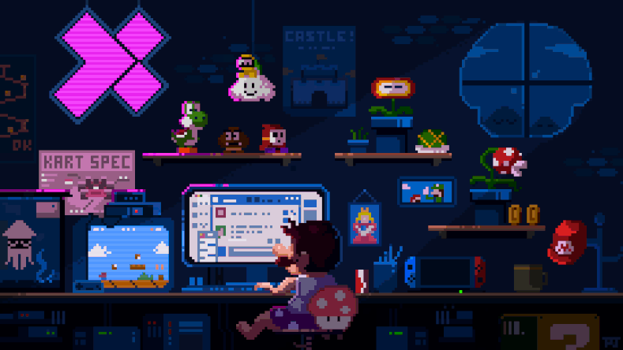

  <a href="https://github.com/thedevjack">
  <a href="https://github-readme-stats.vercel.app/api/top-langs/?username=thedevjack&theme=blue-green">
 

 
  
  
  
  
  
    
  
  

  
  ##
 

   
   
    
  
  
      
 
    

 
<b>Visitors Count</b>
  

 
 
    

  
   
  
   
 

  
